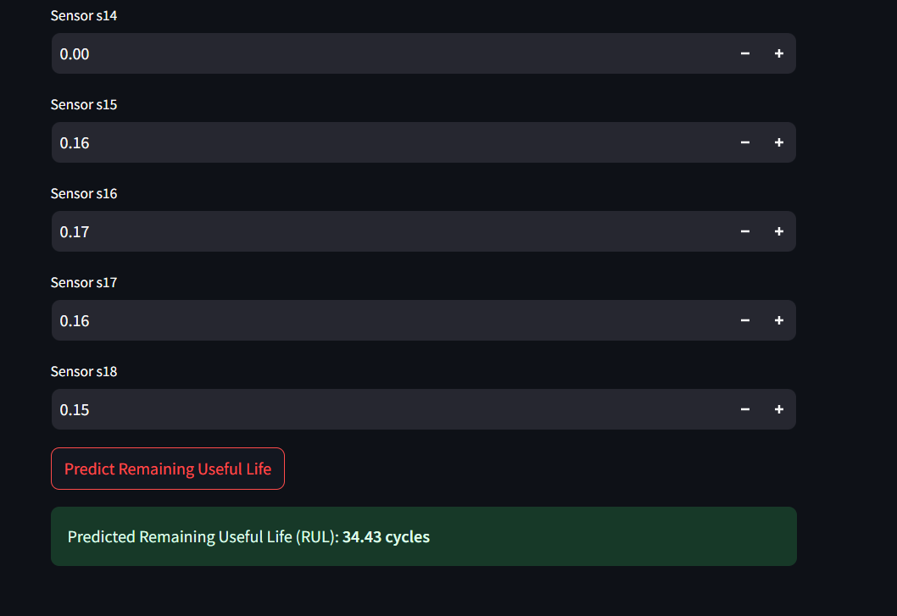

# 🚀 Predictive Maintenance System using LSTM

This project is a predictive maintenance application that estimates the **Remaining Useful Life (RUL)** of industrial machines using sensor data. It uses an **LSTM deep learning model** to analyze time-series sensor readings and predict machine failure in advance.

The system is deployed as an **interactive Streamlit web app**, allowing users to input sensor values and get real-time RUL predictions.

---

## 🧠 Problem Statement

Unexpected machine failures can cause downtime and high maintenance costs. Predictive maintenance helps detect failures early by analyzing sensor data and forecasting when a machine is likely to fail.

---

## 📊 Dataset

- CMAPSS Turbofan Engine Dataset (NASA)
- Multivariate time-series sensor data
- Used for training and evaluating the LSTM model

---

## ⚙️ Approach

- Data preprocessing and normalization
- Feature scaling using `StandardScaler`
- Time-series modeling using **LSTM**
- Predict Remaining Useful Life (RUL)
- Deploy model using **Streamlit**

---

## 🖥️ Web Application

The Streamlit app allows users to:
- Load a trained LSTM model and scaler
- Input values for **18 sensors**
- Predict Remaining Useful Life in real time

**Output:**  
Predicted Remaining Useful Life (RUL) in cycles


---

## 🛠️ Tech Stack

- Python  
- NumPy, Pandas  
- TensorFlow / Keras (LSTM)  
- Scikit-learn  
- Streamlit  

---

## 📂 Project Structure
├── app.py
├── models/
│ ├── lstm_model.h5
│ └── scaler.save
├── data/
│ └── CMAPSSData/
├── notebooks/
│ └── 01_data_processing.ipynb
├── README.md


---

## ▶️ How to Run the App

```bash
pip install -r requirements.txt
streamlit run app.py

---

